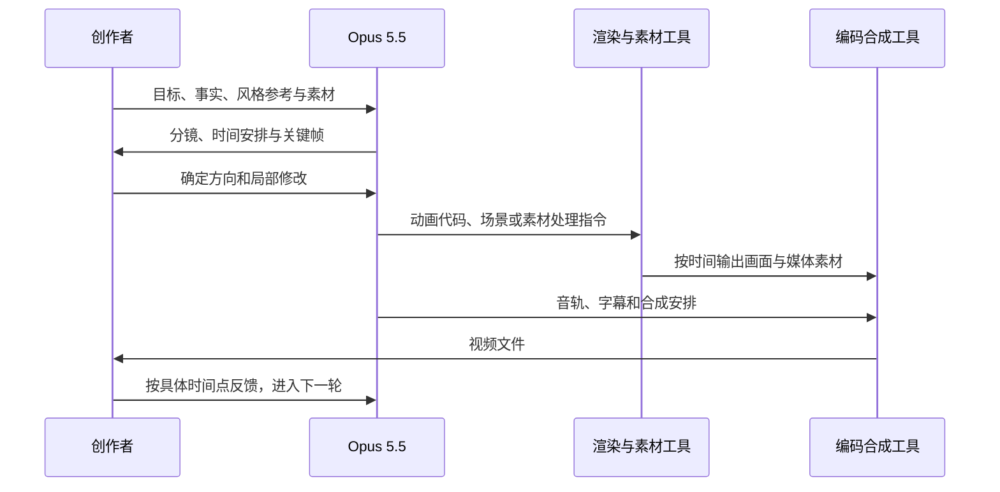

<title>Opus 5.5 怎样把代码变成视频：8 个精选案例与制作经验</title>

从连续变形的 UI，到手绘叙事、历史战役和舞蹈合成，拆解值得复用的创作方法。

这篇文章面向希望用 Opus 5.5 制作短视频的创作者、设计师和产品团队。你不必先掌握动画编程，但需要准备清楚的创作目标，以及一个能运行代码、读取素材和调用制作工具的工作环境。读完后，你应能判断自己的项目适合哪条技术路线，并写出一份可执行、可检查的制作要求。

**核心认识：**在本文讨论的案例中，Opus 5.5 主要承担策划、编程和工具编排；浏览器、图形引擎及音视频工具负责把这些指令变成成片。优秀结果来自叙事、视觉规则、时间轴和迭代检查共同工作。Anthropic 当前模型概览列出的输出模态是文本，代码与工具调用才是理解这些视频的入口。[来源：Anthropic 模型概览](https://platform.claude.com/docs/en/models/overview)。

整理日期：2026 年 10 月 1 日。本文从当前项目案例库中筛选，以其中 1,704 条“视频编辑与制作”记录为重点，按方法独特性、可迁移性和来源充分程度精选，不按点赞排名。作者展示、公开提示与本文建议分别表述；这是一篇案例分析，未对八个工程逐一复现。

# 先理解原理：把一段视频写成可执行的程序

以代码动画为例，可以把每一帧理解为一个函数的结果：

```text
画面 = render(当前时间, 场景数据, 素材, 固定随机种子)
第 n 帧的时间 = n / 每秒帧数
30 秒 × 30 fps = 900 帧
```

Opus 写出物体、文字、相机和动作的规则。运行时，渲染器在指定时间取出画面，编码器再将画面序列与音轨合成视频。900 帧是输出帧数，并不意味着模型调用了 900 次。Remotion 按帧编号驱动 React 画面；HyperFrames 的引擎则将网页定位到准确时间后捕获画面。[Remotion 基础原理](https://www.remotion.dev/docs/the-fundamentals)；[HyperFrames 渲染引擎](https://hyperframes.heygen.com/packages/engine)。



图中的“渲染与素材工具”可以是浏览器、Blender，也可以包含外部图像或视频模型。音轨可以来自录音、语音合成、程序配乐或已有音乐。分工需要由项目明确，不能仅凭一条“用 Opus 做的”就判断全部制作过程。

## 同样叫“做视频”，实际有三种工作

| 路线 | Opus 负责什么 | 典型用途与代价 |
|-|-|-|
| 代码生成与渲染 | 用 HTML、Canvas、SVG、React 或 3D 脚本定义画面与运动 | 适合文字、图表、界面、风格化动画；复杂角色与自然动作需要更多制作工作 |
| 多模型制作 | 写分镜和生成要求，调用图像、视频、语音工具，再组织剪辑 | 可用于写实镜头和角色动作；需要检查跨镜头人物、画风与声音的一致性 |
| 已有素材的编辑与合成 | 剪切、抠像、跟踪、加字幕、驱动动效与混音 | 适合产品发布与实拍后期；质量取决于输入素材和处理精度 |

这是依据下文案例所作的工作分类，项目可以同时采用多条路线。“画面由代码绘制”也不等于没有外部字体、音乐、照片或语音模型。明确素材与工具的贡献，才容易复现和改进。

# 八个精选案例：每个解决一种不同的问题

## 连续变形的 UI：让同一对象贯穿全片

**作者：**@twoclipping。[作品与公开提示](https://x.com/twoclipping/status/2103273003555402193)。案例库 ID：lists-006。


**独特之处：**作者要求按钮、加载器、播放器、滑块、标签页等状态，由同一个形状接续变化。这种制作规则用对象的连续性组织转场，让观众知道视线应该跟随什么。

**方法拆解：**公开提示先限定 UI 状态、配色与音乐，再安排节拍；要求每个时间点的样式都由 seek(t) 计算，并在完整渲染前按节拍检查画面。代码在这里承担可精确修改的动作设计。

**可以照搬的经验：**做产品动效时，先决定“哪个对象贯穿始终”，再画它的状态变化。把功能切换转化为尺寸、位置或内容的连续变化，减少每一屏重新建立视觉焦点的负担。

**证据边界：**我们读到了原帖制作要求，但未审计最终源码。提示中要求的弹簧运动、子帧模糊和无缝循环，仍需在复现时逐项验收。

## 《The First Spark》：把视觉风格写成叙事规则

**作者：**@morpheusdv。[作品](https://x.com/morpheusdv/status/2102910531560731063)；[公开提示](https://x.com/morpheusdv/status/2102910588565225905)。案例库 ID：gosail-060。

**独特之处：**公开提示围绕墨滴角色创造世界，将故事组织为发现、扩张、失控和重新建立秩序。纸色、墨色、线条与生长动作共同服务于这个叙事设计。

抽帧可见米白纸感、黑色角色与大量留白，视觉辨识度来自少量一致的元素。远景中的角色较小，复用这种风格时要额外检查手机端的主体可见性。

**方法拆解：**提示把抽象的“手绘感”拆成笔触粗细、轮廓、留白与角色动作，并要求统一时间轴、固定随机种子、任意时间定位；开发顺序是先做好第一场和核心绘画系统，再延伸其他场景。

**可以照搬的经验：**先写“角色想做什么，行动如何改变环境”。为故事选择有限的视觉规则，再让这些规则贯穿各场景。第一个完整镜头应该同时证明风格、表演和导出流程都能成立。

**证据边界：**60 秒、30 fps、横竖屏等是公开提示中的目标，本轮未逐项确认最终交付达标，也未验证作者的成本比较。

## 三分钟 AI 历史短片：把画面、旁白与配乐拆成制作层

**作者：**@kimmonismus。[作品与工具说明](https://x.com/kimmonismus/status/2102844654169575547)；[提示来源](https://x.com/kimmonismus/status/2102847451111772219)。案例库 ID：uc-0962。


**独特之处：**作者说明这支三分钟短片采用 React/TypeScript 与 Remotion，画面由 SVG、Canvas 绘制，配合开源语音合成和 Python 配乐。它提供了一种可拆解的知识视频制作结构。

**方法拆解：**画面表达、旁白时长、字幕节奏和声音安排是不同层次的问题。代码化工程可以分别修改这些层，再沿同一时间安排重新合成。

在检查的画面中，深色背景、橙色高光和反复出现的“the”符号连接了不同场景；部分辅助文字较小。这提供了一个具体取舍：保持视觉线索的同时，仍要照顾阅读距离。

**可以照搬的经验：**知识视频先确定解释顺序与事实依据，再决定每个概念用文字、关系图还是过程动画表达。先听懂旁白，检查一屏是否只承载一个主信息，然后再增加视觉复杂度。

**证据边界：**工具栈与制作时长来自作者说明，工程未经本轮复现。影片涉及历史叙述与未来设想，画面完成度不能替代事实核查；“代码制作”也仍包含语音工具的贡献。

## 奥斯特里茨战役：用数据约束构建有空间关系的叙事

**作者：**@WinterArc2125。[作品](https://x.com/WinterArc2125/status/2103116235009347650)；[提示与仓库入口](https://x.com/WinterArc2125/status/2103116689944502720)。案例库 ID：uc-1377。


**独特之处：**作者尝试把战场地形、军队、光照和镜头组织在同一空间里，制作约五分钟的历史影片，并称使用了卫星地形和历史日期的太阳位置。

**方法拆解：**空间类题材可以先建立场景中的关系：山在哪里、部队从哪里移动、镜头应如何交代战术。数据约束提供结构，导演选择决定观众能否看懂。

抽帧中可见地面士兵视角与俯视地图，两种尺度分别服务于场面体验和战术理解。地图上的部分浅色标签对比偏弱，提醒我们氛围与可读性需要一起检查。

**可以照搬的经验：**制作地图、城市或历史场景时，将“依据哪些资料”与“采用何种表现手法”分开记录。每个关键镜头同时写清事实来源和解释目的。

**证据边界：**作者自报约 90 分钟构建、4 小时渲染、40 美元云代理费用，不能外推为普遍成本。地形、太阳位置及史实尚未独立验证；这个案例也提醒我们，写出工程和等待渲染是两笔时间。

## GoodCase 宣传片：让产品事实先于宣传语言

**作者：**@aiwarts。[作品](https://x.com/aiwarts/status/2103419586964316483)；[公开提示](https://x.com/aiwarts/status/2103419813263815008)。案例库 ID：gosail-072。

**独特之处：**制作要求让模型读取本地代码、查看真实网站、寻找品牌与案例素材，先核对内容，再决定视频展示什么。

**方法拆解：**提示把约 30 秒的片子组织成真实效果开场、浏览路径展示和品牌收尾，同时要求横屏与竖屏版本。画面可以来自网站已有图片、影片和截图。

本次检查的横版画面确实包含案例展示、网站详情、提示词页和品牌结束卡。网页中的密集文字在视频里不易阅读，因此应明确哪些信息需要放大，哪些只承担背景作用。

**可以照搬的经验：**制作产品片时，为每一个卖点提供真实界面或证据，并从开始就考虑不同画幅的信息摆放。竖屏版本需要重新检查主体、字幕与界面细节的空间，不能默认裁掉左右两边就完成适配。

**证据边界：**作者称未接入 AI 图像、视频或音乐生成模型，但已有网站素材仍是输入的一部分。双比例输出为作者报告，本轮未逐一验证两个导出文件。

## 基于现有 3D 数据的产品变体：固定产品，再改变演出

**作者：**@yoshifujidesign。[主帖](https://x.com/yoshifujidesign/status/2103988134069617127)；[追加版本](https://x.com/yoshifujidesign/status/2103989912676741479)。案例库 ID：gosail-054。

**独特之处：**作者把已有产品 3D 数据加入制作流程，展示不同风格版本，并认为这有助于保持产品外形稳定。

**方法拆解：**把产品几何与品牌资产视为固定输入，将镜头、灯光、背景、字幕和节奏视为可变参数。这为系列广告提供了清晰的修改边界。

**可以照搬的经验：**交付产品模型、Logo 和标准配色时，同时写明哪些部分必须保持原样，哪些部分允许创作。多个版本应复用同一资产来源。

**证据边界：**作者的稳定性判断是经验性描述，未提供完整工程或几何误差测量。这一条的价值在于输入与版本管理方法。

## 舞蹈骨架驱动文字与光：让画面效果跟随真实动作

**作者：**@aicreataro。[作品与制作说明](https://x.com/aicreataro/status/2103757144789221819)。案例库 ID：uc-2348。


**独特之处：**举手、挥拳、落地等动作成为图形和文字出现的依据。作者说明歌曲来自 Suno，舞蹈视频来自 MiniMax H3，Opus 提取骨架并在 After Effects 中驱动效果。

**方法拆解：**已有视频经过分析后，运动数据可以成为动画参数。文字和光效由身体位置与动作触发，后期表达因此与素材发生联系。

**可以照搬的经验：**先挑少量需要强调的动作，再决定跟随什么部位、出现多久、何时退场。作者特别提到，持续显示跟踪效果会让人疲劳，展示与收回仍需要人观看后判断。

**证据边界：**模型与工具分工有作者说明；本轮未验证逐帧骨架精度。不能将底层舞蹈视频和歌曲都算作 Opus 直接生成。

## 多模型协作：按镜头需求分配工具

**作者：**@KanaWorks_AI。[作品与分工说明](https://x.com/KanaWorks_AI/status/2103836147277345052)。案例库 ID：gosail-133。

**独特之处：**作者明确拆分了职责：Opus 负责整体设计、代码统筹和精细控制；Seedance 负责角色动作与音画匹配；GPT Image 负责静帧；MiniMax 负责背景微动。

**方法拆解：**同一支片子可以采用不同的素材生产方式，再由共同的剪辑与合成安排把它们连接起来。代码控制与生成模型的表现能力可以互相补充。

**可以照搬的经验：**为每个镜头列出输入、负责工具和验收标准。例如人物外观要参考哪张图，动作在第几秒发生，字幕在哪里出现，背景允许变化到什么程度。用这些接口减少跨工具返工。

**证据边界：**分工来自作者原帖。“便宜”“稳定”属于个人实践评价，不能据此排出模型优劣；具体接口、账号和工具可用性需要按实际环境确认。

# 把案例转化为自己的工作流程

以下是一套由上述案例归纳的制作建议。适合先完成 15—30 秒的第一支短片，再扩展长度。每一步都应产生可以检查的结果，避免将所有问题留到最终导出时才发现。

| 阶段 | 具体动作 | 这一阶段的完成标准 |
|-|-|-|
| 明确任务 | 写观众、用途、一句话主旨、时长、比例和结尾希望观众采取的行动 | 用一句话说明观众看完应记住什么 |
| 整理输入 | 提供事实材料、参考片、Logo、字体、照片、录音或产品模型；标注可用范围 | 每个卖点与关键资产都有依据，缺失项明确列出 |
| 设计分镜 | 按时间段列出镜头目的、主对象、动作、画面文字与声音 | 镜头连起来能讲清内容，时长之和正确 |
| 做小样 | 先做开头、中间和结尾的风格帧，再完成一个短镜头的预览与导出 | 风格一致、文字可读，制作工具能输出正常文件 |
| 扩展与修改 | 沿统一时间轴补齐场景；按具体时间点逐轮修改 | 修改范围可追踪，已有镜头没有被无意改坏 |
| 验收交付 | 检查关键帧、完整播放、移动端效果与素材来源，保留工程 | 成片可观看，文字和声音正确，下一次能明确修改入口 |

已有方法库可以减少从头组织工程的工作。例如 [Lemo-Opuscar 导演指南](https://github.com/lemomo-ai/lemo-opuscar/blob/main/DIRECTOR.md)把叙事、镜头与声音的设计放在制作之前；其[技术指南](https://github.com/lemomo-ai/lemo-opuscar/blob/main/TECHNIQUE.md)提供确定性绘图、共享时间轴、渲染和检查的实现路径。借鉴时优先学习结构与做法，再用自己的主题和素材形成作品。

## 选择工具时，先看已有输入

如果内容以界面、字幕和图表为主，可以从 Remotion 或 HyperFrames 这类代码视频工具入手；如果视觉语言依赖手绘笔触和程序化形状，Canvas、SVG 或 WebGL 提供更直接的表达空间。已有 3D 模型时，可以围绕对应的三维工具组织工作；已有真人或生成的视频素材时，则把重点放在剪辑、跟踪和合成。

这些是根据工具结构与案例归纳的选型建议。框架会影响工作量，但单纯安装一个 skill 或模板，不会自动补齐事实、素材、镜头目的和审美判断。

# 六条最值得保留的制作经验

## 把风格词转成可检查的规则

“高级、电影感、有设计感”只能表达愿望。继续补充主体占比、字体数量、颜色范围、留白、动作速度和转场规律，模型才有稳定的执行依据。参考图也应说明借鉴哪一项：构图、光线、笔触或节奏。

例如可以要求“只用两种字号，每屏一个主信息；标题完整停留后才切镜；同一圆形负责连接三个场景”。这些规则能通过看小样检查，反馈也更容易落到具体修改。

## 让时间成为所有动画的共同依据

在代码动画里，给定同一时间点，应能得到可重复的场景状态。这样才能单独检查一帧、重渲染一个片段或并行输出；依赖真实时钟、未固定的随机数或上一次播放残留状态，都会让结果更难重现。这个要求在 UI 形变与 First Spark 的公开提示中都很明确。

确定的时间安排也不保证所有机器输出逐像素相同。浏览器、字体、图形设备和编解码器仍可能影响画面；需要严格复现时，应固定这些依赖。[来源：HyperFrames 引擎说明](https://hyperframes.heygen.com/packages/engine)。

## 先确定声音落点，再安排画面动作

节奏强的视频，应先找清音乐节拍和关键变化，再安排动作；知识视频则应优先保证旁白能听懂、字幕能读完。音乐速度、旁白实际时长与画面事件最好记录在同一张时间表里。

@twoclipping 的另一份[产品片制作提示](https://x.com/twoclipping/status/2102554209166000267)专门要求校准音乐实际鼓点，并把音效峰值对准视觉事件。可迁移的原则是检查观众感受到的同步，而不是只比较音频文件的起始时间。

## 把反馈写成“时间点＋问题＋期望”

可执行的反馈示例：“第 8—11 秒标题还未读完就消失，请延长停留并压缩下一段空镜”；“第 15 秒主产品被字幕遮住，请在竖屏版重新布局”；“最后一次循环接回开头时，核对对象位置与运动方向”。

每轮集中解决一种问题：先故事，再构图，再动作，最后声音与输出。若每次都要求全片换一种风格，就很难判断哪些修改带来了改善。

## 检查要覆盖静态、动态和最终文件

静帧适合发现溢出、重叠、错字和构图问题；短片段适合检查形变、穿帮和转场；完整带声音播放才能发现信息过密、节奏拖沓、旁白被盖住等问题。检查必须包括最终编码文件，因为预览正常不代表导出结果相同。

建议在实际观看设备上再看一次，尤其检查中文字体、字号、字幕安全区和横竖屏布局。代码执行成功只是制作流程中的一个检查点。

## 记录总成本，也保留可修改工程

估算成本时分别记录模型使用、外部素材或生成服务、机器渲染和人工检查。长片、三维场景、运动模糊及高分辨率都会改变资源需求。社交平台上的单次耗时与费用只能作为那一次尝试的记录。

交付应包含成片、源码、素材清单、字体与版本信息、字幕、时间安排和运行说明。对产品片，还应把品牌文字、颜色和数据集中管理，让后续改版有明确入口。

# 一份可以直接改写的制作提示

下面是本文综合整理的原创模板，不是任何案例作者原提示的复制。将方括号替换成实际内容；本轮先得到可评审的小样，确认后再继续全片。

```text
我要为［目标观众］制作一支［用途］视频。
观众看完应该记住：［一句话主旨］。
结尾希望观众采取的行动：［行动，或明确无需行动］。

交付规格：［时长］，［画幅］，［分辨率］，［帧率］。
已有材料：［资料、网站、品牌资产、素材文件与可用范围］。
参考方向：［参考链接，以及只借鉴其中哪些特征］。
必须保持：［事实、产品外形、品牌文字、配色等］。
允许创作：［镜头、转场、背景、表现手法等］。
资源约束：［可用工具、外部服务、预算与等待时间］。

先读取材料并列出缺口，提出与现有环境相符的工具分工。
请区分代码绘制的画面、已有素材、外部生成的素材和声音。
不要把未知功能或数据写成已证实的事实。

本轮先交付：
1. 内容主线与分镜表：时间、目的、画面、文字、声音。
2. 开头、中间、结尾三张实际风格帧。
3. 一个短镜头的可播放小样，以及一次成功的视频导出。

如果采用代码动画，所有画面状态应能按指定时间重复计算。
统一记录画面、声音与字幕时间；固定随机种子与关键依赖。
先检查字体和素材是否加载完成，再输出画面。

小样确认后，沿既定风格扩展全片。
每轮说明改了哪些时间段，保留可回退的工程版本。
最终检查错字、事实、布局、转场、音画关系和导出文件。
同时交付视频、源码、素材清单、字幕与复现说明。
```

# 来源与阅读边界

案例来自本项目 all_cases.json 及其原帖快照，项目汇总见[WaytoAGI Opus 5.5 案例库](https://github.com/waytoagi-team/gallery/tree/main/cases/models/claude-opus-5-5-usecases)。本文保留了案例 ID，便于回到库中查找。X 原帖本次直接回访受到 403 限制，正文依据项目已保存的原帖与回复文本核读，快照主要来自 9 月 28 日；库元数据标注的更新日期为 9 月 30 日。

“公开提示”证明作者提出过这些要求，不能证明最终工程逐条实现，也不能证明公开内容就是全部对话。耗时、成本、一次生成、历史准确性及多模型效果均按作者声明处理。文中的可复用经验与工具选择是分析建议，不是成功率测试。

视觉检查覆盖 UI 形变、First Spark、AI 历史、战役、GoodCase 和骨架动效六个案例，每条各查看六个等距抽帧，并为部分插图另取较清晰原帧。未完整实时播放或听取音轨，因此不对流畅度、音画同步、跟踪稳定性和循环接缝作独立验证结论。

官方原理资料于 2026 年 10 月 1 日核对：[Anthropic 模型概览](https://platform.claude.com/docs/en/models/overview)、[Remotion 基础](https://www.remotion.dev/docs/the-fundamentals)、[HyperFrames 引擎](https://hyperframes.heygen.com/packages/engine)。延伸阅读：[Lemo-Opuscar 仓库](https://github.com/lemomo-ai/lemo-opuscar)及文中链接的导演、技术指南。本文未安装或运行这些参考项目。

文内原作画面仅用于对应案例的介绍与分析，署名与作品链接见各案例；作品、图片和素材权利归原作者。复用第三方音乐、字体、照片或视频时，应按具体素材的许可条件处理。